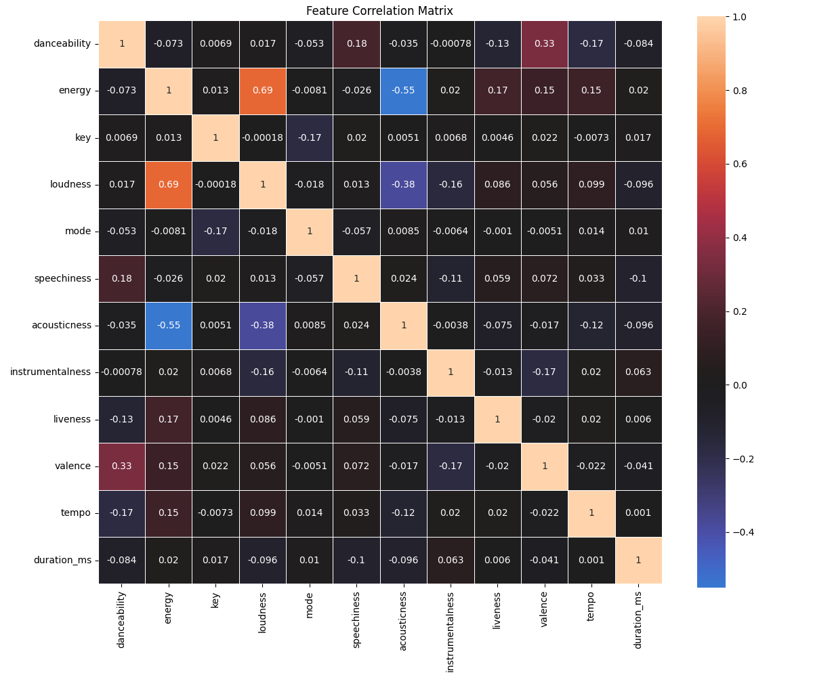
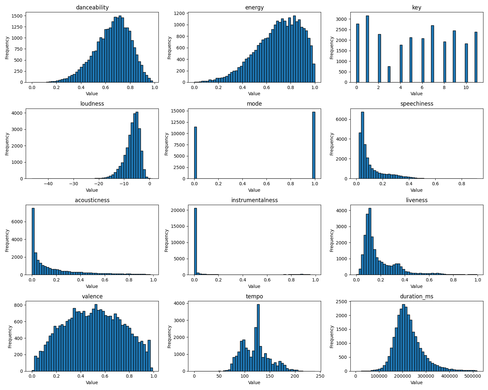
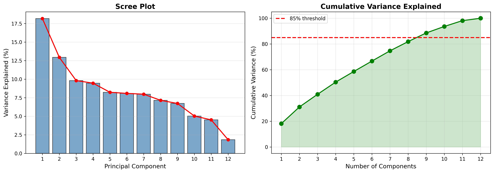
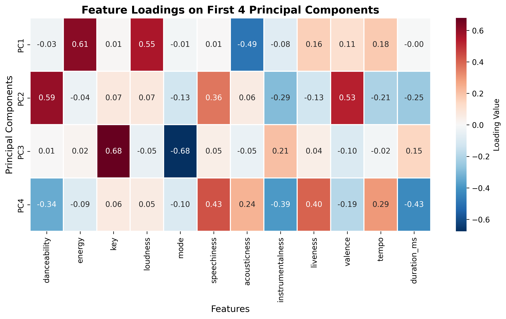
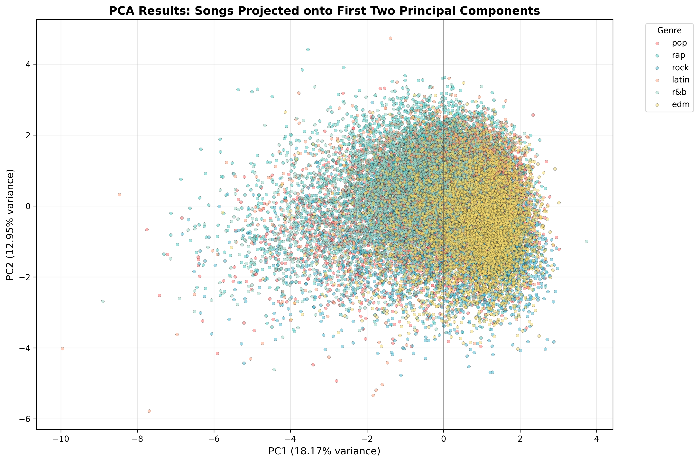
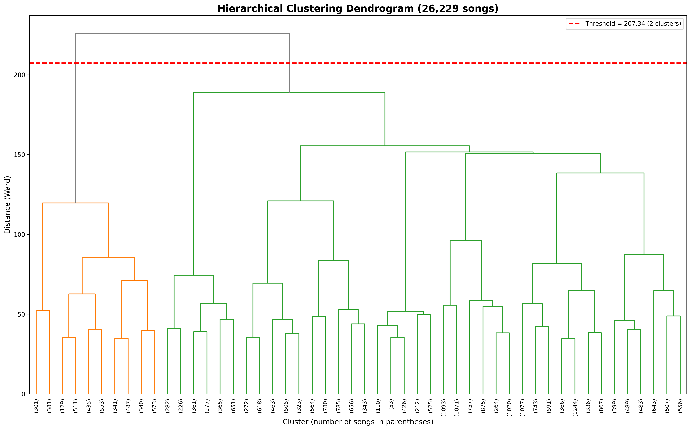
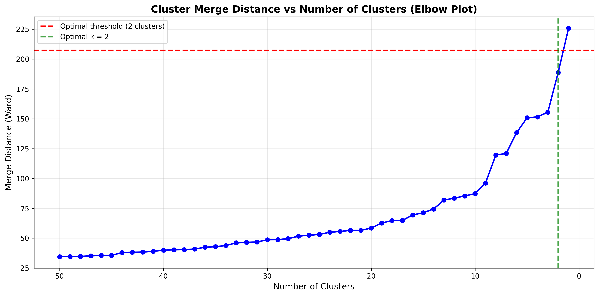
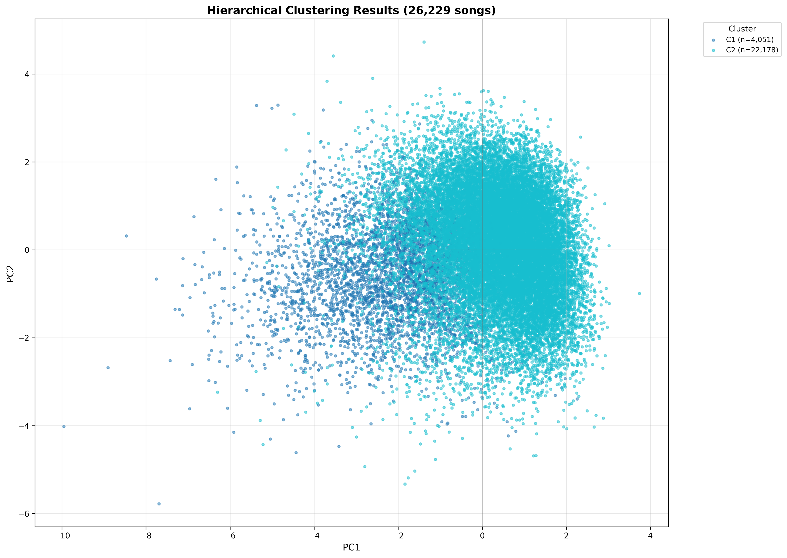
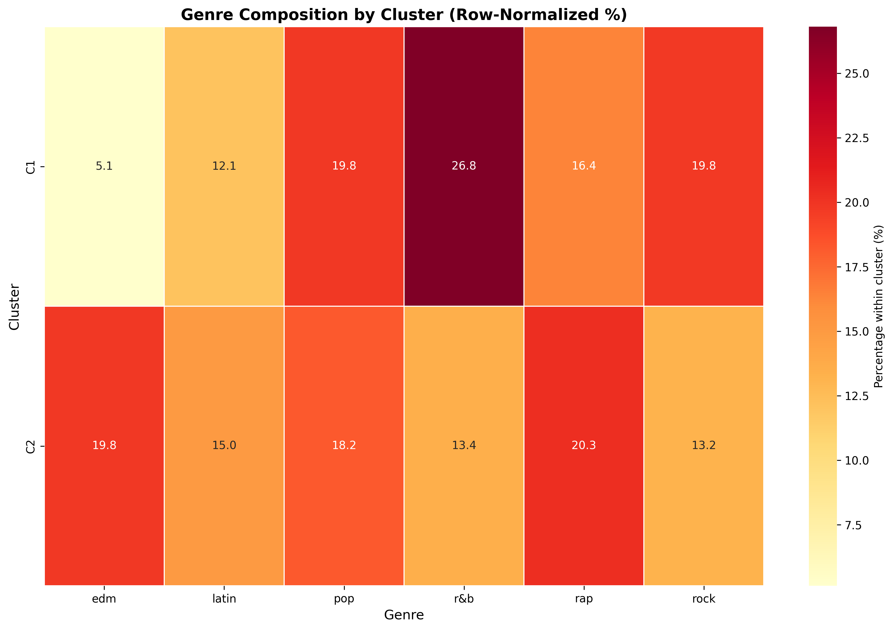

# Spotify Songs Analysis - PCA & Clustering

Analysis of 26,229 Spotify songs using **Principal Component Analysis (PCA)** and **Hierarchical Clustering**.


## Project Overview

This project explores audio characteristics of songs across different genres to understand:
- How various audio features correlate with each other
- Which features contribute most to song variation
- How songs naturally cluster based on their audio properties
- Whether machine learning can discover genre-like groupings

### Dataset
**Source**: [Kaggle - Spotify Songs](https://www.kaggle.com/datasets/sujaykapadnis/spotify-songs/data)  
**Size**: 26,229 tracks  
**Features**: 12 audio characteristics  
**Genres**: 6 categories (pop, rap, rock, latin, EDM, R&B)

#### Audio Features Analyzed:
- **danceability** - How suitable for dancing (0.0 to 1.0)
- **energy** - Intensity and activity measure
- **loudness** - Overall loudness in decibels
- **speechiness** - Presence of spoken words
- **acousticness** - Confidence measure of acoustic sound
- **instrumentalness** - Predicts if track contains no vocals
- **liveness** - Presence of an audience
- **valence** - Musical positiveness (happy vs sad)
- **tempo** - BPM (beats per minute)
- **duration_ms** - Track length in milliseconds
- **key** - Musical key (0-11)
- **mode** - Major (1) or minor (0)

---

## Project Pipeline

### 1. Data Cleaning (`data_cleaning.py`)
- Removes irrelevant columns (album info, playlist metadata)
- Eliminates duplicate tracks (by ID and name+artist)
- Handles missing values
- Ensures correct data types for all features

**Output**: [data/IN/cleaned_songs.csv](data/IN/cleaned_songs.csv)

### 2. Correlation & Normalization (`data_corr_norm.py`)
Analyzes feature relationships and standardizes data:
- Computes correlation matrix to identify related features
- Standardizes features using `StandardScaler` (mean=0, std=1)
- Generates correlation heatmap and feature distribution plots

**Outputs**:
- [data/IN/scaled_features.csv](data/IN/scaled_features.csv) - Standardized features
- [data/OUT/correlation_matrix.csv](data/OUT/correlation_matrix.csv) - Feature correlations


*Strong correlations: energy-loudness (0.76), energy-acousticness (-0.71)*


*Distribution of audio features across all songs*

### 3. PCA Analysis (`pca_analysis.py`)
Reduces dimensionality while preserving variance:
- Transforms 12 features into principal components
- Identifies optimal components (85% variance threshold)
- Analyzes feature loadings to interpret components
- Visualizes songs in reduced 2D space

**Key Findings**:
- First 7 components capture 85% of variance
- PC1 explains ~25% of variation (mainly energy/acousticness)
- PC2 explains ~15% (danceability/valence)

**Outputs**:
- [data/OUT/pca_data.csv](data/OUT/pca_data.csv) - Transformed data
- [data/OUT/pca_loadings.csv](data/OUT/pca_loadings.csv) - Feature contributions


*Scree plot showing variance explained by each component*


*Heatmap showing how original features contribute to principal components*


*Songs projected onto first two principal components, colored by genre*

### 4. Hierarchical Clustering (`hierarchical_clustering.py`)
Groups similar songs using agglomerative clustering:
- Uses Ward's linkage method on PCA-reduced data
- Automatically determines optimal number of clusters (elbow method)
- Analyzes cluster composition by genre
- Generates comprehensive visualizations

**Key Findings**:
- Optimal clustering produces distinct song groups
- Clusters show mixed genres, suggesting audio features transcend genre labels
- Some clusters specialize in certain characteristics (e.g., high energy, acoustic-focused)

**Outputs**:
- [data/OUT/clustered_songs.csv](data/OUT/clustered_songs.csv) - Songs with cluster labels


*Hierarchical clustering dendrogram showing song groupings*


*Distance vs. number of clusters to determine optimal k*


*Cluster assignments visualized in reduced 2D space*


*Distribution of genres across clusters reveals mixed composition*

---

## How to Run

```bash
# Step 1: Clean and prepare data
python src/data_cleaning.py

# Step 2: Analyze correlations and normalize features
python src/data_corr_norm.py

# Step 3: Perform PCA dimensionality reduction
python src/pca_analysis.py

# Step 4: Apply hierarchical clustering
python src/hierarchical_clustering.py
```

Each script saves outputs to `data/OUT/` and `figures/` directories.

---

## Key Insights

1. **Feature Correlations**: Energy and loudness are strongly correlated (0.76), while energy and acousticness are inversely related (-0.71)

2. **Dimensionality Reduction**: PCA successfully reduces 12 features to 7 components while retaining 85% of information

3. **Genre Overlap**: Traditional genre labels don't perfectly align with audio feature similarities - songs from different genres can be acoustically similar

4. **Cluster Characteristics**: Hierarchical clustering discovers natural groupings based on audio properties that often cross genre boundaries
